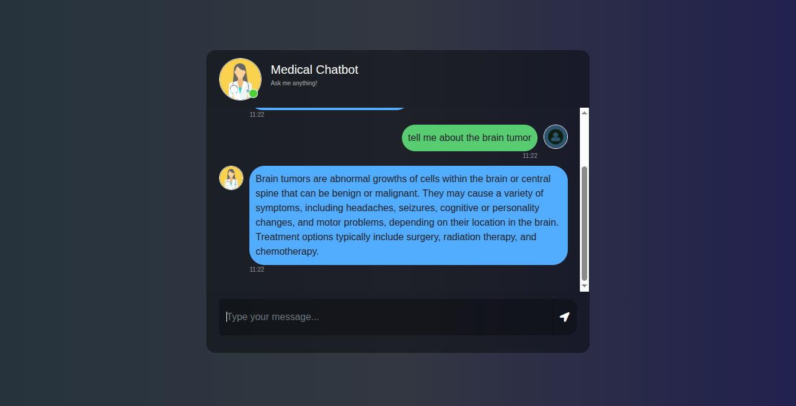

# Medical-Chatbot


# How to run?
### STEPS:

Clone the repository

```bash
git clonehttps://github.com/entbappy/Build-a-Complete-Medical-Chatbot-with-LLMs-LangChain-Pinecone-Flask-AWS.git
```
### STEP 01- Create a conda environment after opening the repository

```bash
<div align="center">


<p>
<strong>Medi‑Bot</strong><br/>
🩺 AI-powered medical Q&A using <a href="https://python.langchain.com">LangChain</a>, <a href="https://www.pinecone.io">Pinecone</a>, and <a href="https://openai.com">OpenAI</a>. Fast retrieval over your own PDF corpus.
</p>

[](https://huggingface.co/spaces/Monster10/medi-bot)
[](https://flask.palletsprojects.com/)
[](https://python.langchain.com/)
[](https://www.pinecone.io/)
[](https://platform.openai.com/)
[](LICENSE)

</div>

---

## ✨ Features
- 🔍 Retrieval‑augmented generation (RAG) over your medical PDFs
- 🧠 SentenceTransformers embeddings (`all-MiniLM-L6-v2`)
- 📦 Pinecone vector store for low-latency similarity search
- 💬 Flask web interface (`templates/chat.html`)
- 🚀 GitHub Action → Hugging Face Space Docker deploy

## 🔑 Requirements
| Item | Description |
|------|-------------|
| Python | 3.10+ |
| OPENAI_API_KEY | OpenAI chat model access |
| PINECONE_API_KEY | Pinecone index & vector ops |

## 🛠 Local Setup
```bash
# clone
git clone https://github.com/shubhamchimkar/Medical-Chatbot.git
cd Medical-Chatbot

# create venv
python -m venv venv
source venv/bin/activate

# install deps
pip install -r requirements.txt

# env vars
cat > .env <<'EOF'
OPENAI_API_KEY=YOUR_OPENAI_KEY
PINECONE_API_KEY=YOUR_PINECONE_KEY
EOF

# (optional) ingest PDFs to Pinecone
python store_index.py

# run app
python app.py
# open http://localhost:8080
```

```bash
conda activate medibot
```


### STEP 02- install the requirements
```bash
pip install -r requirements.txt
```


### Create a `.env` file in the root directory and add your Pinecone & openai credentials as follows:

```ini
PINECONE_API_KEY = "xxxxxxxxxxxxxxxxxxxxxxxxxxxxx"
OPENAI_API_KEY = "xxxxxxxxxxxxxxxxxxxxxxxxxxxxx"
```


## 📂 Project Structure
```text
app.py              # Flask app + RAG chain
store_index.py      # One-time ingestion of PDFs → Pinecone
src/
	helper.py         # Loading, splitting, embeddings
	prompt.py         # System prompt template
templates/chat.html # Front-end chat UI
static/style.css    # Basic styling
Dockerfile          # Docker deploy (PORT 7860)
DEPLOYMENT.md       # Extended deploy guide
assets/banner.svg   # README banner
```

## ☁ Deploy (Hugging Face Spaces)
1. Create Space `Monster10/medi-bot` (SDK: Docker, Hardware: CPU Basic)  
2. Add Secrets under Settings → Variables & secrets: `OPENAI_API_KEY`, `PINECONE_API_KEY`  
3. Add `HF_TOKEN` (write scope) as GitHub repo secret → triggers sync workflow  
4. Push to `main` → Action builds filtered bundle → Space rebuilds  

Notes:
- Excludes large files (`data/`, PDFs) from sync to bypass 10 MiB limit.
- Run ingestion locally only (vectors must exist before queries).

## 🧩 Configuration
| Key | Default | File |
|-----|---------|------|
| Pinecone Index | `medical-chatbot` | `store_index.py`, `app.py` |
| Embedding Model | `all-MiniLM-L6-v2` | `helper.py` |
| Chat Model | `gpt-4o` | `app.py` |
| PORT | `7860` (Spaces) | `Dockerfile`, `app.py` |

## Configuration
- Index name: `medical-chatbot` (change in `app.py`/`store_index.py` if needed)
- Model: `sentence-transformers/all-MiniLM-L6-v2` for embeddings; Chat model via OpenAI (`gpt-4o`)
- Environment variables loaded via `.env` (`python-dotenv`)

## 🛠 Troubleshooting
- Memory errors on other free hosts → use Spaces (16 GB)
- Push rejected (large file) → verify filters in workflow or use Git LFS
- Blank answers → confirm Pinecone index populated + API keys valid
- 500 errors → check env var names & ingestion order

## 🖼 UI Preview
Single current interface screenshot:



<sub>If the image does not display, ensure it is committed: `git add assets/ss.png && git commit -m "Add UI screenshot" && git push origin main`.</sub>

## 📜 License
MIT
```bash
# run the following command to store embeddings to pinecone
python store_index.py
```

```bash
# Finally run the following command
python app.py
```

Now,
```bash
open up localhost:
```


